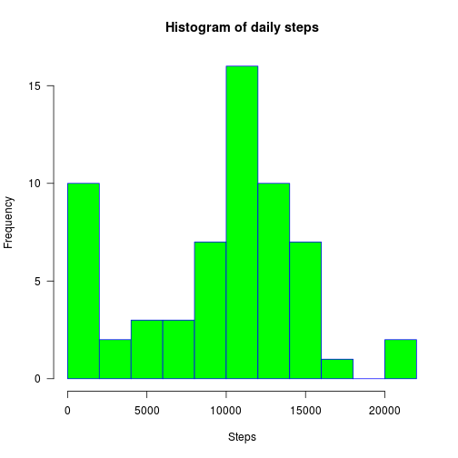
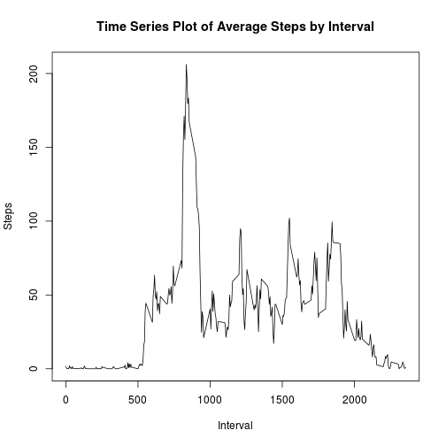
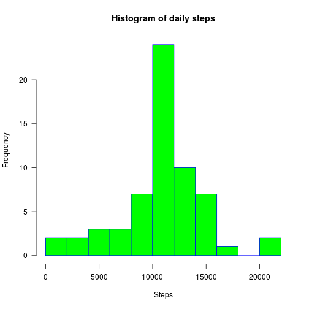
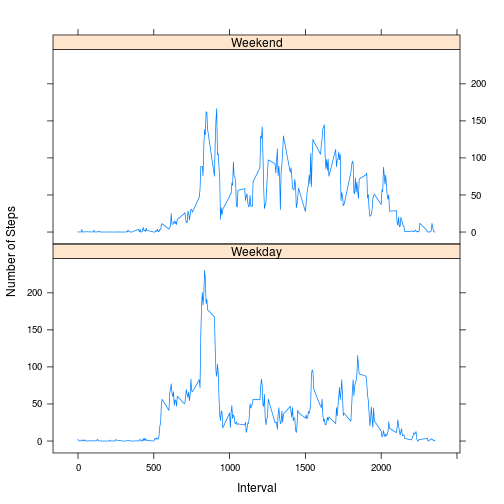

# Loading and preprocessing the data

```r
# Load the data
data <- read.csv("activity.csv")

# Convert the 'date' column to Date type
data$date <- as.Date(data$date)
```


## What is mean total number of steps taken per day?

```r
# Calculate the total number of steps taken per day
steps_by_day <- aggregate(x = data$steps, by = list(data$date), FUN = sum, na.rm = TRUE)
names(steps_by_day) <- c("date", "steps")

# Make histogram
hist(steps_by_day$steps, 
     main="Histogram of daily steps", 
     xlab="Steps", 
     border="blue", 
     col="green", 
     las=1, 
     breaks=10)
```

 

```r
# Mean of the total number of steps taken per day
mean(steps_by_day$steps, na.rm = TRUE)
```

```
## [1] 9354.23
```

```r
# Median of the total number of steps taken per day
median(steps_by_day$steps , na.rm = TRUE)
```

```
## [1] 10395
```


## What is the average daily activity pattern?

```r
# Time series plot (i.e. type = "l") of the 5-minute interval (x-axis) and the average number of steps taken, averaged across all days (y-axis)
avg_steps <- aggregate(data$steps, by = list(data$interval), FUN = mean, na.rm = TRUE)
names(avg_steps) <- c("interval", "average_steps")
plot(avg_steps$interval, avg_steps$average_steps, type = "l", main = "Time Series Plot of Average Steps by Interval", xlab = "Interval", ylab = "Steps")
```

 


## Imputing missing values

```r
# The total number of rows with NAs
nrow(data[is.na(data$steps),])
```

```
## [1] 2304
```

```r
# Which 5-minute interval, on average across all the days in the dataset, contains the maximum number of steps?
avg_steps[which.max(avg_steps$average_steps), "interval"]
```

```
## [1] 835
```

```r
# Imputing missing step values with median for that day
imputed <- merge(x = data, y = avg_steps, by = "interval", all.x = TRUE)
imputed[is.na(imputed$steps),c("steps")] <- imputed[is.na(imputed$steps),c("average_steps")]

# Cleaning data
imputed$date <- as.Date(imputed$date)

# Make histogram
total_steps <- aggregate(x = imputed$steps , by = list(imputed$date), FUN = sum ,na.rm=TRUE)
names(total_steps) <- c("date","steps")
hist(total_steps$steps, 
     main="Histogram of daily steps", 
     xlab="Steps", 
     border="blue", 
     col="green", 
     las=1, 
     breaks=10)
```

 

```r
# Mean of the total number of steps taken per day
mean(total_steps$steps, na.rm = TRUE)
```

```
## [1] 10766.19
```

```r
# Median of the total number of steps taken per day
median(total_steps$steps , na.rm = TRUE)
```

```
## [1] 10766.19
```


## Are there differences in activity patterns between weekdays and weekends?

```r
# Create a new factor variable in the dataset with two levels – “weekday” and “weekend” indicating whether a given date is a weekday or weekend day.
imputed$weekday <- as.factor(ifelse(weekdays(imputed$date) %in% c("szombat","vasárnap"), "Weekend", "Weekday"))

# Make a panel plot containing a time series plot (i.e. type = "l") of the 5-minute interval (x-axis) and the average number of steps taken, averaged across all weekday days or weekend days (y-axis).
avg_steps_by_interval_and_weekday <- aggregate(imputed$steps, by = list(imputed$interval, imputed$weekday), FUN = mean, na.rm = TRUE)
names(avg_steps_by_interval_and_weekday) <- c("interval", "weekday", "steps")

library(lattice)
xyplot(steps~interval | weekday, data = avg_steps_by_interval_and_weekday,
      type = 'l',
      xlab = 'Interval',
      ylab = 'Number of Steps',
      layout = c(1,2))
```

 
